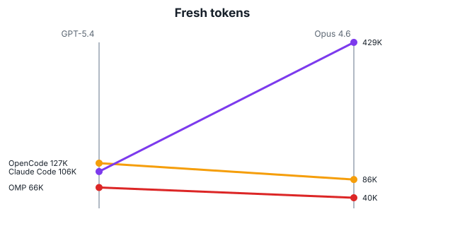
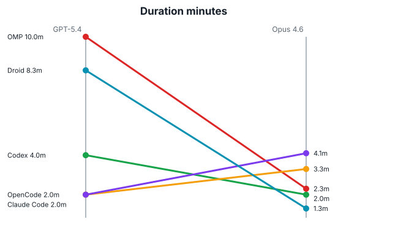
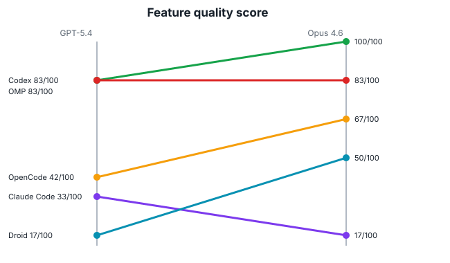
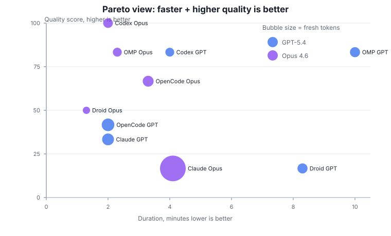
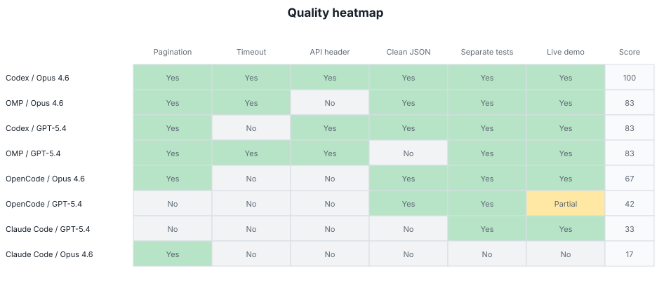
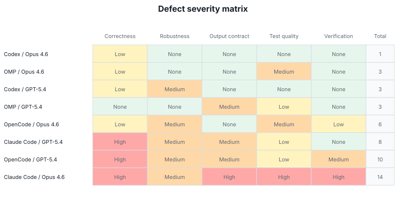

# AI Coding Agent Benchmark

Local benchmark comparing four coding-agent harnesses on the same TypeScript CLI task: fetch a GitHub user's public repositories, sort by stars, support table/JSON output, `--limit N`, error handling, and tests.

Tested harnesses:

- Codex
- OMP
- OpenCode
- Claude Code

Tested model families:

- GPT-5.4
- Opus 4.6

Codex / Opus 4.6 is excluded from completed-run comparisons because local Claude routing failed through the proxy.

## Short read

Across completed runs, OMP was the strongest overall result in this local benchmark. Codex / GPT-5.4 was the lightest and best single GPT run, but there was no completed Codex / Opus run. OpenCode was fast but CPU-heavy and missed pagination in the GPT run. Claude Code had the weakest reliability profile, especially the Opus run, where tests were embedded in the production CLI file.

This is an exploratory local-machine benchmark, not a statistically powered benchmark suite.

## Visualizations

### Model shift by harness

Codex is omitted because the Opus run did not complete.







### Pareto view: duration vs quality

Upper-left is better: shorter duration, higher checklist quality. Bubble size is fresh token usage.



### Quality heatmap

Checklist score uses yes=1, partial=0.5, no=0.



### Defect severity matrix

Severity is qualitative and derived from manual review findings in `summary.md`. Total uses High=3, Medium=2, Low=1, None=0.



## Completed runs

| Run | Duration | Fresh tokens | Feature score | Main issue |
|---|---:|---:|---:|---|
| Codex / GPT-5.4 | ~4.0 min | ~37K | 83 | No timeout; silent 100-page cap. |
| OMP / GPT-5.4 | ~10.0 min | ~66K | 83 | JSON emits full GitHub blob. |
| OpenCode / GPT-5.4 | ~2.0 min | ~127K | 42 | Missing pagination; wrong first-run output. |
| Claude Code / GPT-5.4 | ~2.0 min | ~106K | 33 | Missing pagination; raw GitHub field names. |
| OMP / Opus 4.6 | ~2.3 min | 40,478 | 83 | No fetch/network unit tests; no deterministic tie-breaker. |
| OpenCode / Opus 4.6 | ~3.3 min | 85,983 | 67 | No timeout; weaker error-path coverage. |
| Claude Code / Opus 4.6 | ~4.1 min | 428,588 | 17 | Tests embedded in production CLI file; no live verification. |

## Repository contents

- `summary.md`: narrative benchmark summary and review findings.
- `results/*.csv`: sampled RSS/CPU process metrics for each run.
- `visualizations/benchmark_visualizations.html`: standalone HTML report.
- `visualizations/*.svg`: README visualization assets.
- `visualizations/benchmark_visualizations_data.json`: normalized run-level data used by the visualizations.
- `visualizations/build_visualizations.py`: regenerates the HTML, JSON, and SVG assets.
- Run scripts: `run_*.sh` and `monitor.sh`.

## Reproduce visualizations

```sh
python3 visualizations/build_visualizations.py
```

## Caveats

- Local-machine benchmark only.
- Small sample size.
- Some summary values are approximate.
- GitHub unauthenticated API rate limits affected later live verification checks.
- GPT-5.4 and Opus 4.6 runs are not perfectly equivalent because tool sandboxes and provider paths differ.
